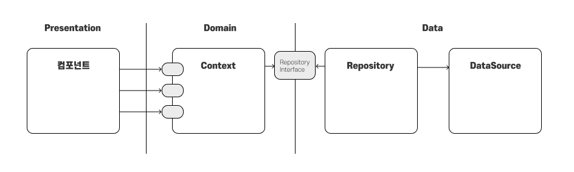
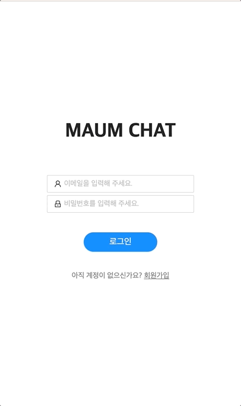
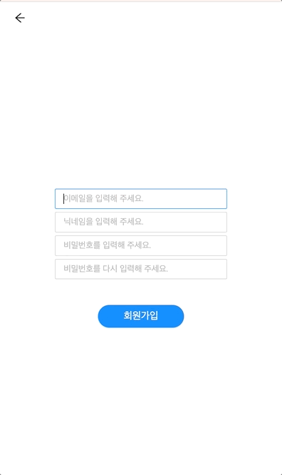
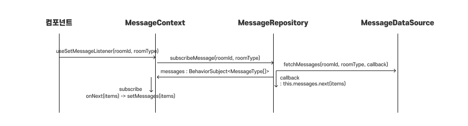
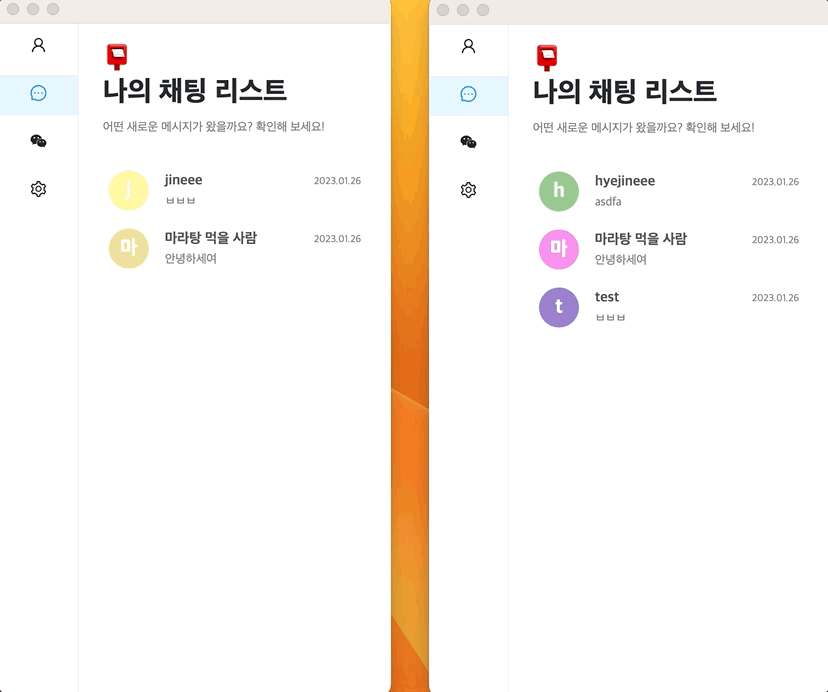
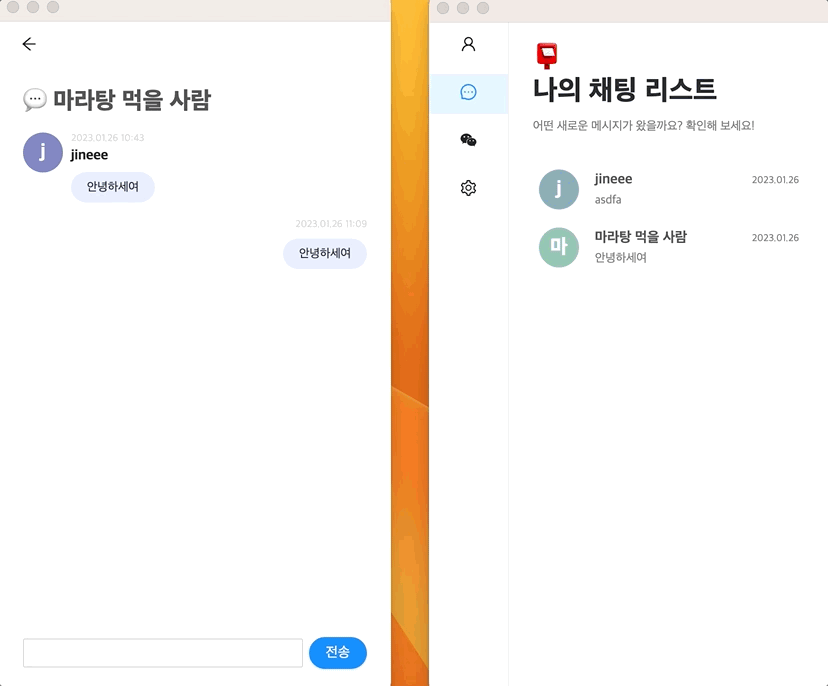
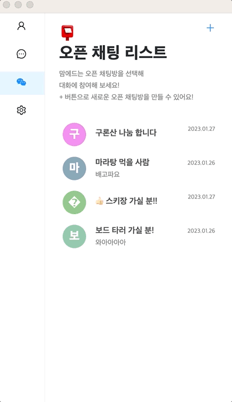
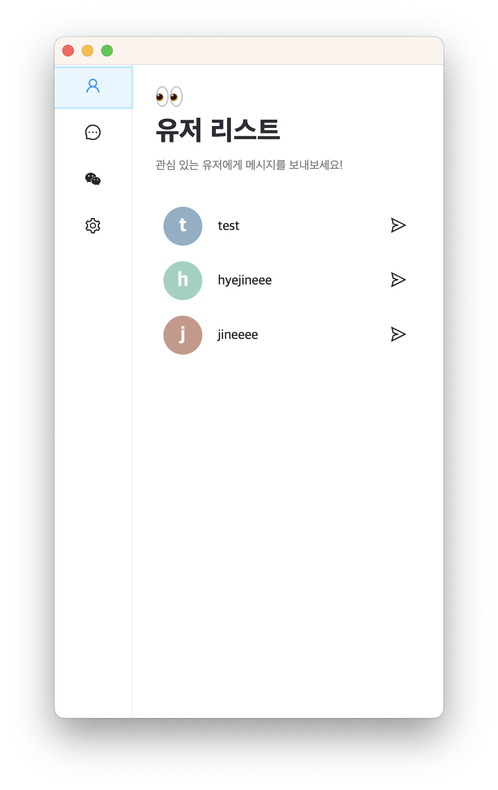
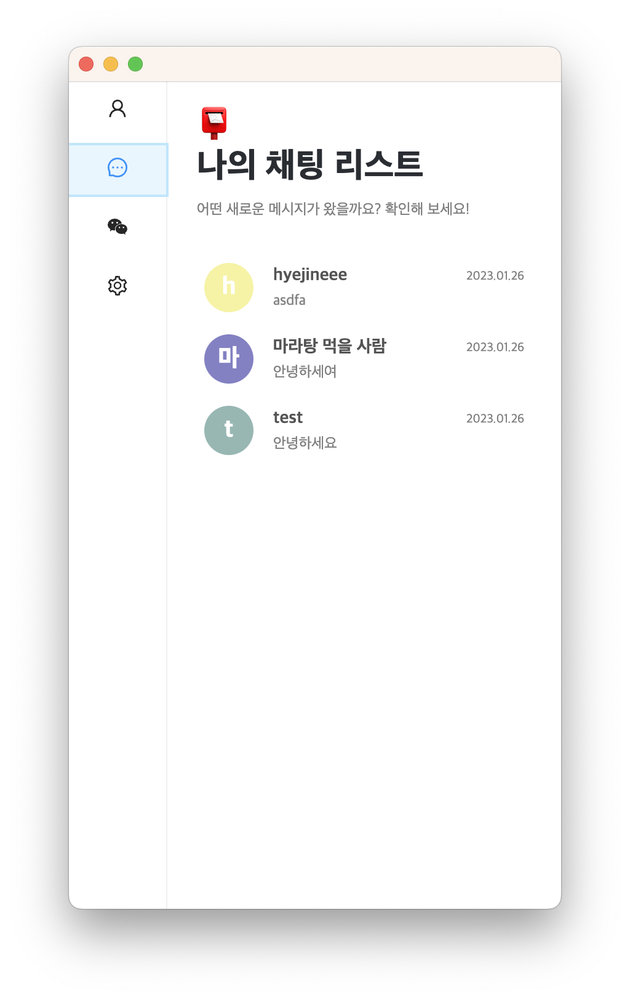
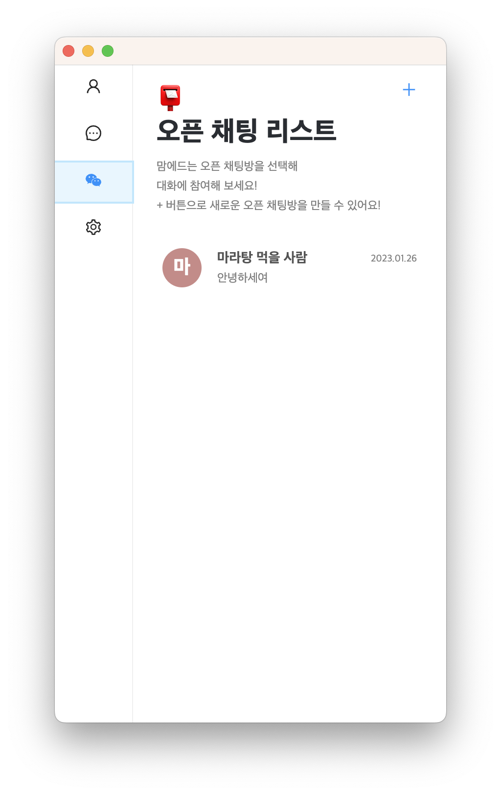

# Chat Desktop App
nextron과 firebase를 사용한 데스크탑 채팅 애플리케이션입니다. 
- [x]  회원가입
- [x]  로그인
- [x]  유저 목록
- [x]  1: 1 채팅
- [x]  그룹채팅
## 목차
- [구현 내용](#1)
- [회고](#2)
- [기술 스택](#3)
- [실행 방법](#4)

## 구현 내용  <a id="1"></a>

### 전체 구조


- 파이어 베이스와 애플리케이션이 강하게 결합되지 않도록 하는데 집중해서 구현했습니다.
- Repository 패턴을 사용하여 외부 데이터에 접근하는 로직을 추상화하여 데이터 접근 로직과 비즈니스 로직을 분리하는데 집중해서 구현했습니다. 
- 기존에 컴포넌트에 강하게 결합되어 있던 비즈니스 로직을 커스텀 훅을 사용하여 분리했습니다. 모든 컴포넌트에서 각 로직이 재사용될 수 있도록 구현했습니다.


<br/>
<br/>

### 로그인, 회원가입 
- Firebase의 Authentication을 사용해 로그인, 회원가입 기능을 구현했습니다.
- react-hook-form과 yup을 사용해 입력값의 유효성 검사 기능을 구현했습니다.

<div style="display : flex">
&nbsp;&nbsp;

</div>

<br/>
<br/>

### 1:1, 1:n 채팅
- Firebase store의 onSnapshot 메서드를 사용하여 실시간으로 변경되는 데이터 베이스를 관찰할 수 있도록 했습니다. 
- repository에 rxjs의 subject를 두어 컴포넌트에서 직접적으로 onSnapshot 메소드에 연결되지 않도록 구현했습니다.


<div style="display : flex; justify-content: space-between;">
&nbsp;&nbsp;

</div>

<br/>
<br/>


### 그룹 채팅방 생성  
- 제목과 초대할 유저를 선택하여 그룹 채팅방을 만들 수 있도록 구현했습니다.

<div style="display : flex; ">
&nbsp;&nbsp;
</div>

<br/>
<br/>

### 유저 리스트, 나의 채팅 리스트. 오픈 채팅 리스트
<div style="display : flex">



</div>

## 회고 <a id="2"></a>
- 컴포넌트가 구체적인 라이브러리(파이어 베이스)에 의존하지 않도록 하기 위해 고민하는 과정이 즐거웠습니다. 
- 비즈니스 로직과 데이터 접근 로직의 분리가 미흡한 것 아쉽습니다. repository에 비즈니스 로직이 스며든 것 같습니다. 
- 앞으로 테스트 코드를 작성하면서 비즈니스 로직이 repository로 스며든 부분 관심사 분리가 제대로 적용되지 않은 부분을 찾아 리팩터링을 진행할 예정입니다.
- 테스트 코드를 작성하면서 비즈니스 로직이 컴포넌트와 제대로 분리되지 않다는 것을 느꼈습니다. 

<br/>

## 기술 스택 <a id="3"></a>


  
 
 
 
 


## 실행방법 <a id="4"></a>
1. 프로젝트를 클론합니다.
```
git clone https://github.com/hyejineee/maumlab-assignment.git
```
2. 클론한 프로젝트 내부로 이동합니다. 
```
cd maumlab-assignment
```
3. 의존 패키지를 설치합니다. 
```
yarn
```
4. 파이어 베이스 사용을 위해 renderer 폴더 하위에 .env 파일을 추가합니다. .env 파일의 내용은 다음과 같습니다.
```
# firebase 
NEXT_PUBLIC_ENV_FIREBASE_APP_KEY=
NEXT_PUBLIC_ENV_FIREBASE_AUTH_DOMAIN=
NEXT_PUBLIC_ENV_FIREBASE_PROJECT_ID=
NEXT_PUBLIC_ENV_FIREBASE_STORAGE_BUCKET=
NEXT_PUBLIC_ENV_FIREBASE_MESSAGING_SENDER_ID=
NEXT_PUBLIC_ENV_FIREBASE_APP_ID=
```
5. 다음 명령어를 사용하여 서버를 실행합니다.
```
yarn dev 
```
